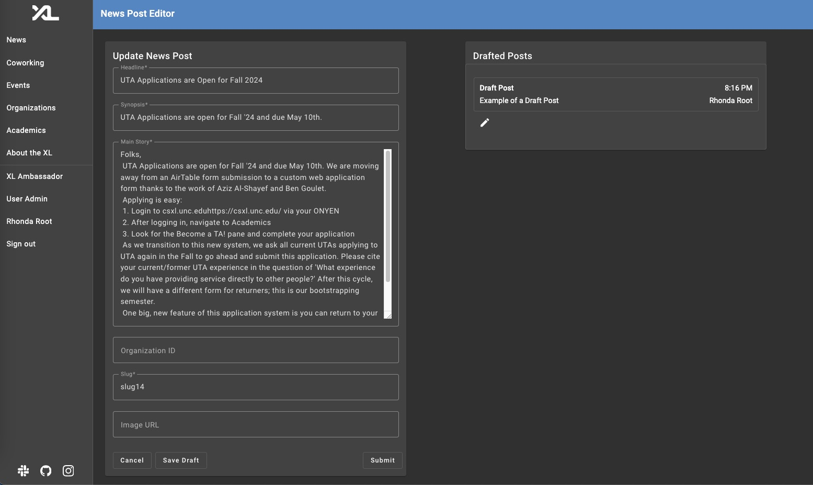
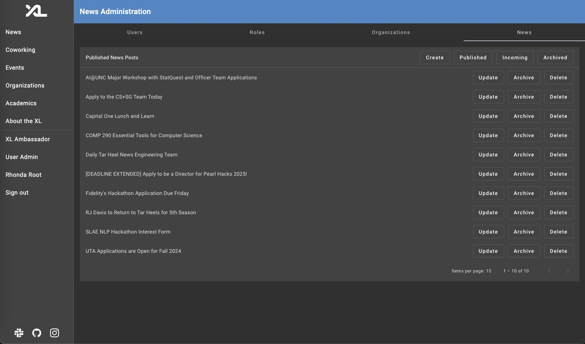

# News Feed Feature Technical Specifications

This document contains the technical specifications for the News feature of the CSXL web application. It also includes sample data representation of the feature and descriptions of underlying database / entity-level representation decisions.

The News Feature adds news post data and a news feed that now acts as the 'Home Page' of the CSXL web application. It displays news posts in paginated fashion that allows the user to see the most recent posts as well as previous posts on a week-by-week basis. Each post contains a link to the 'full page' that displays all of the post's necessary information (Headline, Author, Date, Main Story, Image, etc).

All visitors of the CSXL page are able to view the News Feed in it's entirety. However, only authenticated users have the ability to create a post and submit it for review. Admins have their own specific view where they can approve/publish, update, archive, and delete a news post.

# Authors

- [Alphonzo Dixon](https://github.com/KingTrey3)
- [Embrey Morton](https://github.com/embreymorton)
- [Ishmael Percy](https://github.com/IshmaelpUNC)
- [Jayson Mbugua](https://github.com/JaysonMbugua)

## Tables of Contents

* [Frontend Features](#FrontendFeatures)
  * [User Features](#UserFeatures)
     * [News Feed](#NewsFeed)
     * [Full News Post](#FullNewsPost)
     * [Create Post](#CreateNewsPost)
  * [Admin Features](#AdminFeatures)
     * [Update Post](#UpdateNewsPost)
     * [Published Post View](#PublishedNewsPosts)
     * [Incoming Post View](#IncomingNewsPosts)
     * [Archived Post View](#ArchivedNewsPosts)
  * [Conclusion](#Conclusion)
* [Backend Implementation](#BackendImplementation)
  * [Entity Design](#EntityDesign)
  * [Pydantic Model Implementation](#PydanticModelImplementation)
  * [API Implementation](#APIImplementation)
  * [Testing](#Testing)
* [Future Considerations](#FutureConsiderations)

## Frontend Features <a name='FrontendFeatures'></a>

The frontend features add _6_ new Angular components, all at either the `/news` or `/admin/news` route.

### User Features <a name='UserFeatures'></a>

The following pages (except for the editor) have been added and are available for all users of the CSXL site. These pages are ultimately powered by new Angular service functions connected to new backend APIs.

#### News Feed <a name='NewsFeed'></a>


The News Feed feature now functions as the CSXL home page, but is also available on the side navigation toolbar at `/news`. In addition to this, the CSXL logo redirects users to this page. It is available to any user, authenticated or not, and displays published news posts in paginated fashion. Upon selecting a card, the user can click on the post-details button or the headline to route to the full post page.

The News Feed also contains a fully functional search bar that allows a user to filter posts by Headline, Organization Name, Author Name, and keywords in the main story. Only for authenticated users, it displays a "Create Post" button at the bottom that routes to the News Post Editor component.

#### Full News Post<a name='FullNewsPost'></a>


The full news post page displays all of the information for a given news post and is routable from the news feed at `news/:slug` by pressing the `Post Details` button. It also has the capabilities to hold an image URL and is contained in a flexible wrapper to adjust the size of the post on screen.

To view this page for a specific post, it must either be `published` or the user must be the corresponding author or an admin. If none of these conditions are satisfied, it will be blank with a "Post Not Found" page title.

#### Create News Post<a name='CreateNewsPost'></a>


The create post page is the way authenticated users will be allowed to create a post, after submitting a post to be published, the post will go through an approval proccess before being published to the news feed. This page currently exists at `news/new/edit` route.

This editor also contains functionality for a draft widget on the right-hand side, which only displays if the current user has at least one draft stored in the database.

#### Update News Post<a name='UpdateNewsPost'></a>



The update post page is the way posts can be updated quickly, instead of having to make new ones. When done by an admin, these updates are instant and do not need to be approved. It is also usable by a user to make progress to their drafts, which happens to be the only scenario where they can use it. This page currently found out at `news/:slug/edit` route. 

### Admin Features <a name='AdminFeatures'></a>

#### Admin News Feed <a name='NewsFeed'></a>


The Admin News Feed mirrors the news feed for any user, but the widget for a post contains buttons to edit or delete a post directly from the feed. Other than that, it is exactly the same and it found at `/news`.

#### Published News Posts<a name='PublishedNewsPosts'></a>



The published news posts page is a new admin specific view that builds upon the three Administration features found at the `User Admin` tab. The page currently lists all of the published posts in the database in alphabetical order, and shows 15 posts per page. It also allows an admin to instantly update, archive, and delete posts. This page is routable at `/admin/news`.

#### Incoming News Posts<a name='IncomingNewsPosts'></a>


The incoming news post page displays all posts that have been submitted and need to be reviewed. To conduct the review, the admin can click on post to see how the full page would look if published. They can also update the post if needed, or save it as a draft were it is essentially sent back to the author. If the post is viable for the news feed, they can publish it. It is routable at `/admin/news/incoming`.

#### Archived News Posts<a name='ArchivedNewsPosts'></a>


The archived news post page mirrors the incoming page, but it displays archived posts. It has the same functionality and allows admins to take a post off the news feed temporarily instead of having to delete it from the database. It is routable at `/admin/news/archived`.

### Conclusion<a name='Conclusion'></a>

In total, the following 6 components have been added:

| Name                     | Route                         | Description                                              |
| ------------------------ | ----------------------------- | -------------------------------------------------------- |
| **News Feed**            | `/news`                       | New XL home page that displays paginated published posts.|
| **News Post**            | `/news/:slug`                 | Main page to display all information of a news post.     |
| **News Post Editor**     | `/news/:slug/edit`            | Form to show when posts are to be created and edited.    |
| **Published Admin View** | `/admin/news`                 | Shows all published posts and exposes CRUD functionality.|
| **Incoming Admin View**  | `/admin/news/incoming`        | Shows all incoming posts and exposes CRUD functionality. |
| **Archived Admin View**  | `/admin/news/archived`        | Shows all archived posts and exposes CRUD functionality. |

...and the following 5 widgets:

| Name                        | Description                                              |
| --------------------------- | -------------------------------------------------------- |
| **News List**               | List of news-card widgets (for pagination on feed).      |
| **News Card**               | Card that displays headline, synopsis, time, and author. |
| **News Post Details Card**  | Card that displays some post info and link to full page. |
| **News Full Card**          | Formatted to display all contents of a news post.        |
| **News Post Drafts**        | Used to display drafts by a user on editor component.    |

## Backend Implementation <a name='BackendImplementation'></a>

The News Feed feature has added 1 new database table and 15 API routes.

### Entity Design <a name='EntityDesign'></a>

The feature creates a new table called `news_post` that stores NewsPost entities. Each entity stores the following fields.

| Attribute                | Description                                              |
| ------------------------ | -------------------------------------------------------- |
| **id***                   | Primary key for a news post.                             |
| **Headline**             | Title of news post displayed on News Feed.               |
| **Synopsis**             | Short description for a news post.                       |
| **Main Story**           | Entire text contents of a news post.                     |
| **Author**               | One-to-Many relationship with a UserEntity.               |
| **Author_ID**            | ID of news post author used for mapping relationship.     |
| **Organization**         | Optional One-to-Many relationship with an OrganizationEntity.      |
| **Organization_ID**      | Optional ID of organization used for mapping relationship.     |
| **State**                | Status of news post (Published, Incoming, Archived, Draft).     |
| **Slug**                 | Unique string used in URL rather than news ID.     |
| **Image_URL**            | Optional link to an image for use in feed listing.     |
| **time**                 | Datetime that news post was created (updated when published).     |
| **modification_date**   | Datetime that news post was modified.     |

In order to accomodate both one-to-many relationships with the User and Organization tables:
- OrganizationEntity now stores a mapped list of NewsPostEntities called "posts"
- UserEntity now stores a mapped list of NewsPostEntities called "posts"

### Pydantic Model Implementation<a name='PydanticModelImplementation'></a>

```py
class NewsPost(BaseModel):
    id: int | None
    headline: str
    main_story: str
    author_id: int 
    organization_id: int | None
    state: str
    slug: str
    image_url: str | None
    time: datetime
    modification_date: datetime
    synopsis: str

class NewsPostDetails(NewsPost):
    author: User
    organization: Organization | None
```
### API Implementaton <a name='APIImplementation'></a>

The News Feed feature adds 15 new APU routes to handle CRUD operations on news posts, as well as specialized retrieval types based on desired state of the news post.


### Technical and User Experience Design Choices <a name='Design_Choice'></a>

#### 1. Custom UI or Model Events Page for News Feed
When planning out the layout for the news feed, we were conflicted about how it should look due to the endless amount of directions we could take it. In the end, we decided that modeling the Events page would make the most sense due to it ensuring consistency throughout the website. Also, the events page already contained functionality for many things that were needed, like pagination, a search bar, overall HTML and CSS structure, etc.

#### 2. Deciding who can Create a News Post
When establishing the news editor, we had to decide who should have permission to create a post. Essentially, the choices were between allowing any authorized user to create one or have it strictly an admin feature. In the end, the conclusion was to allow any logged-in user to create a post, but have it require admin approval prior to being published to the news feed. This implementaiton seemed like a healthy balance of the two and a unique feature that is unlike anything else on the XL website.

### Testing<a name='Testing'></a>

The News Feed feature adds full, thorough testing (29 tests) to every new service function added in the news_post service. All tests pass, and all services created or modified have 100% test coverage.

## Future Considerations<a name='FutureConsiderations'></a>
* Correctly implement News module and News routing module (currently all components and widgets are in app.module and app.routing.module).
* Create official permissions that correspond with how the feature works, as a lot of cases just utilize corresponding ones in events or organization.
* Utilize new functionality of UserEntity and OrganizationEntity now storing lists of news posts.

Original assignment extension ideas:
* Implement multiple author support to allow collaboration on a news post.
* Design and integrate a “Coworking Widget” above/beside the news feed on the home page that is useful for visitors to the XL.
* Mark a news post as an “Announcement” and update the design of the title bar on the app to reflect an announcement exists and can be opened in a modal.


